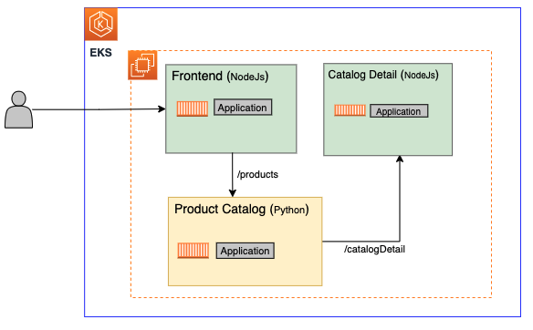
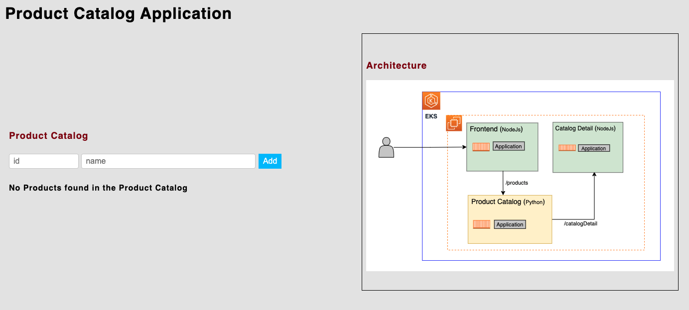
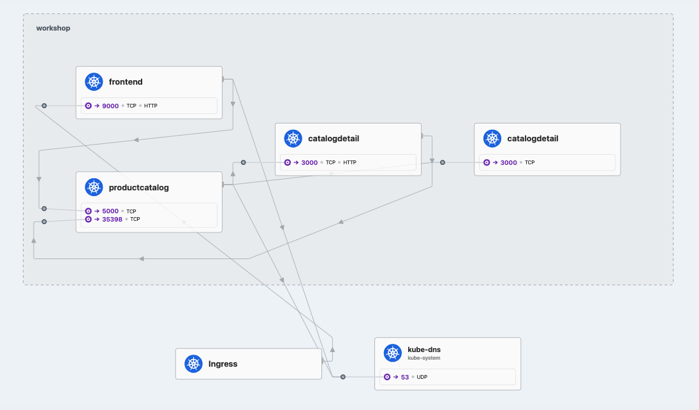
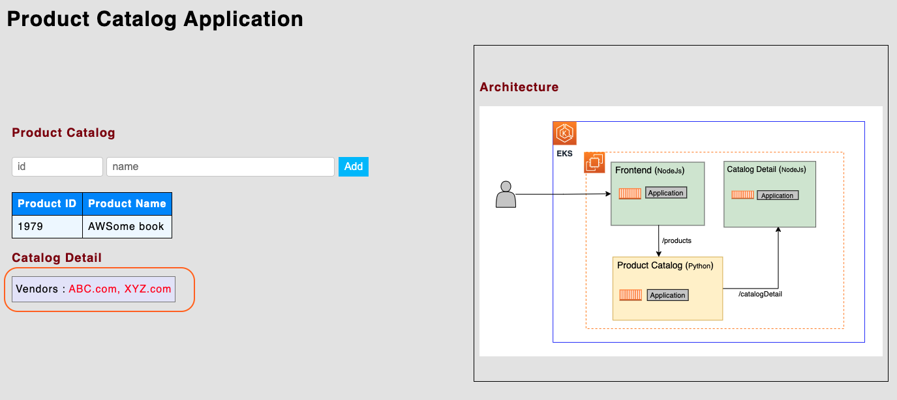

# Elevate Your Amazon EKS Environment with Cilium Service Mesh 

This project shows the steps involved to implement the solution architecture explained in this AWS blog: [Elevate Your Amazon EKS Environment with Cilium Service Mesh]()

## 🎯 Prerequisites

- [ ] A machine which has access to AWS and Kubernetes API server.
- [ ] You need the following tools on the client machine.
	- [ ] [AWS CLI](https://docs.aws.amazon.com/cli/latest/userguide/cli-chap-install.html)
   	- [ ] [Terraform](https://developer.hashicorp.com/terraform/install)
  	- [ ] [kubectl](https://docs.aws.amazon.com/eks/latest/userguide/install-kubectl.html)
  	- [ ] [Cilium CLI](https://docs.cilium.io/en/stable/gettingstarted/k8s-install-default/#install-the-cilium-cli)
	- [ ] [Helm](https://docs.aws.amazon.com/eks/latest/userguide/helm.html)

Assumption : You already configured a [default] in the AWS CLI config/credentials files.

## 🧩 Solution

### Step 1 - Clone this GitHub repo to your machine

```
git clone https://github.com/aws-samples/cilium-mesh-on-eks/
cd cilium-mesh-on-eks
```

### Step 2 - Deploy EKS cluster with Terraform

```
cd terraform
terraform init
terraform apply --auto-approve
```

Sample Output
```
Apply complete! Resources: 65 added, 0 changed, 0 destroyed.

Outputs:

configure_kubectl = "aws eks --region us-west-2 update-kubeconfig --name terraform"
```

It takes ~15 minutes for an EKS cluster creation process to complete. 

> [!NOTE]  
> Update you kubeconfig file using the command provided in the Terraform output to access the Kubernetes API.

Verify that the worker nodes status is `Ready` by `kubectl get nodes`.

### Step 3 - Deploy Cilium on EKS cluster with Helm

```
helm repo add cilium https://helm.cilium.io/
helm upgrade --install cilium cilium/cilium --version 1.14.7 \
--namespace kube-system \
--reuse-values -f ../values_cilium.yaml \
--set hubble.enabled=true \
--set hubble.tls.auto.enabled=true \
--set hubble.metrics.enabled="{dns,drop,tcp,flow,icmp,http}" \
--set hubble.relay.enabled=true \
--set hubble.ui.enabled=true \
--set hubble.ui.service.type=NodePort \
--set hubble.relay.service.type=NodePort \
--set kubeProxyReplacement=strict \
--set encryption.enabled=false \
--set encryption.nodeEncryption=false \
--set routingMode=native \
--set ipv4NativeRoutingCIDR="0.0.0.0/0" \
--set bpf.masquerade=false \
--set nodePort.enabled=true \
--set autoDirectNodeRoutes=true \
--set hostLegacyRouting=false \
--set ingressController.enabled=true \
--set ingressController.loadbalancerMode=shared \
--set cni.chainingMode=aws-cni \
--set cni.install=true
```

Sample Output

```plaintext
Release "cilium" does not exist. Installing it now.
NAME: cilium
NAMESPACE: kube-system
STATUS: deployed
REVISION: 1
TEST SUITE: None
NOTES:
You have successfully installed Cilium with Hubble Relay and Hubble UI.

Your release version is 1.14.7.

For any further help, visit https://docs.cilium.io/en/v1.14/gettinghelp


A few things worth mentioning : 
  - `kubeProxyReplacement=strict` - We replace kube-proxy functionality with Cilium' s own eBPF based implementation. 
  - `ingressController.enabled=true` - We enable Cilium Ingress Controller.
    - `--reuse-values -f ../values_cilium.yaml` - We use a specific annotation from values_cilium.yaml so that Cilium Ingress can be exposed through an AWS Network Load Balancer.
  - `hubble.enabled=true` - We enable Hubble.
  - After the installation Cilium operator restarts the `core-dns` Pods automatically. This is expected based on [Cilium Documentation](https://docs.cilium.io/en/stable/gettingstarted/k8s-install-default/). 

Verify that Cilium Pods and agents are in `Running` state by listing all the pods

```
kubectl get pods -A
```
Sample Output:
```plaintext
NAMESPACE     NAME                                           READY   STATUS    RESTARTS   AGE
kube-system   aws-load-balancer-controller-999bf8598-wmdcr   1/1     Running   0          112m
kube-system   aws-load-balancer-controller-999bf8598-z5gfn   1/1     Running   0          112m
kube-system   aws-node-787h2                                 2/2     Running   0          110m
kube-system   aws-node-wpsbd                                 2/2     Running   0          110m
kube-system   cilium-8ndtq                                   1/1     Running   0          29m
kube-system   cilium-operator-689df79c69-76tbp               1/1     Running   0          29m
kube-system   cilium-operator-689df79c69-pbxtl               1/1     Running   0          29m
kube-system   cilium-wp2df                                   1/1     Running   0          29m
kube-system   coredns-5b8cc885bc-kt5nl                       1/1     Running   0          29m
kube-system   coredns-5b8cc885bc-wbmz5                       1/1     Running   0          29m
kube-system   hubble-relay-6f6f5476d9-z2xgx                  1/1     Running   0          29m
kube-system   hubble-ui-644d9df97c-sghq5                     2/2     Running   0          29m
```

Verify that the `cilium-ingress` service has an AWS DNS name assigned to it in the `EXTERNAL-IP` column of the output

```
kubectl get svc -A
```
Sample Output:
`
NAMESPACE     NAME                                TYPE           CLUSTER-IP       EXTERNAL-IP                                                                     PORT(S)                      AGE
...
OUTPUT TRUNCATED
kube-system   cilium-ingress                      LoadBalancer   172.20.6.189     k8s-kubesyst-ciliumin-849dd6c7c1-36d537f75e9357d8.elb.us-west-2.amazonaws.com   80:32741/TCP,443:30873/TCP   20m
OUTPUT TRUNCATED
...
`

#### Step 3.1 (Optional) - Delete `kube-proxy`

Since Cilium replaces `kube-proxy` you can delete it on the EKS cluster by using the commands below.

```
currentdir=$(basename $PWD)
aws eks delete-addon --cluster-name $currentdir --addon-name kube-proxy --region us-west-2
```

You can confirm the deletion by performing the following command. You should see only `coredns` and `vpc-cni` in the output. 

```
aws eks list-addons --cluster-name terraform us-west-2
```

### Step 4 - Deploy Product Catalog Application

```
kubectl create namespace workshop

cd .. 
cd productapp
helm install productapp . -n workshop
```

Sample Output
```
namespace/workshop created
NAME: productapp
NAMESPACE: workshop
STATUS: deployed
REVISION: 1
TEST SUITE: None
NOTES:
```

### Step 5 - Investigate the Product Catalog Application

Application architecture is as shown below. 



The user accesses `Frontend` microservice, then `Frontend` microservice calls the `Product Catalog` service, and then `Product Catalog` service calls the `Catalog Detail` microservice. The `Catalog Detail` microservice is comprised of two different deployments which are actually identical. The reason we use two deployments is to demonstrate traffic shifting capabilities of service mesh at a later step. 

> [!NOTE]  
> The user access to `Frontend` microservice will be implemented in the next step when we configure Ingress.

Have a look at the current resources deployed as part of the `Product Catalog Application`. 

```
kubectl get deployment,pod,service  -n workshop
```

Sample Output
```
NAME                             READY   UP-TO-DATE   AVAILABLE   AGE
deployment.apps/catalogdetail    1/1     1            1           21m
deployment.apps/catalogdetail2   1/1     1            1           21m
deployment.apps/frontend         1/1     1            1           21m
deployment.apps/productcatalog   1/1     1            1           21m

NAME                                  READY   STATUS    RESTARTS   AGE
pod/catalogdetail-5896fff6b8-tc75k    1/1     Running   0          21m
pod/catalogdetail2-7d7d5cd48b-b9m7t   1/1     Running   0          21m
pod/frontend-78f696695b-tvh9p         1/1     Running   0          21m
pod/productcatalog-64848f7996-gpnl7   1/1     Running   0          21m

NAME                      TYPE        CLUSTER-IP       EXTERNAL-IP   PORT(S)    AGE
service/catalogdetail     ClusterIP   172.20.15.14     <none>        3000/TCP   21m
service/frontend          ClusterIP   172.20.95.212    <none>        9000/TCP   21m
```

> [!NOTE]  
> Notice that there are two deployments for the `Catalog Detail` microservice; `catalogdetail` and `catalogdetail2`. The `catalogdetail` Kubernetes service points out to both `catalogdetail-....` and `catalogdetail2-....` pods.  Meaning that a request from the `productcatalog-.....` Pod to the `catalogdetail` service can get forwarded to any of those Pods. You can verify this by checking the `kubectl describe service catalogdetail` output. This is important to note since it will become relevant in the traffic shifting scenario later on.


### Step 6 - Configure Ingress to access the application

We will now configure an Ingress which will be fulfilled by Cilium Ingress controller. 

```
cat <<EOF | kubectl apply -f -
apiVersion: networking.k8s.io/v1
kind: Ingress
metadata:
  namespace : workshop
  name: productappingress # name given to the ingress
spec:
  ingressClassName: cilium
  rules:
  - http:
      paths:
      - path: / # this rule applies to all requests that specifies this path
        pathType: Prefix
        backend:
          service:
            name: frontend # route all these requests to this service
            port:
              number: 9000 # route the requests to this port of the frontend service
EOF
```

Sample Output
```
ingress.networking.k8s.io/productappingress created
```

### Step 7 - Access the Product Catalog Application

Get the URL to access the application. 

```
CILIUM_INGRESS_URL=$(kubectl get svc cilium-ingress -n kube-system -o jsonpath='{.status.loadBalancer.ingress[*].hostname}')
echo "http://$CILIUM_INGRESS_URL"
```

Sample Output
```
http://k8s-kubesyst-ciliumin-1234567-1234567.elb.us-west-2.amazonaws.com
```

Access the application URL either using `curl` or a browser. You should see the following web page.



### Step 8 - Access Cilium Hubble UI for Service Map Visualization

You can use Cilium Hubble to visualize service dependencies. Use the commands in the following command snippet. You will see a new browser tab automatically being spun up and see the Hubble UI on that page. Select `workshop` namespace in there.

```
cilium hubble ui
```

Sample Output
```
ℹ️  Opening "http://localhost:12000" in your browser...
```

Sample Screenshot



> [!NOTE]  
> You may need to refresh the web page if the Hubble user interface does not show up after a few seconds.

### Step 9 - Add a product on the web page

Access the application URL again and add a product. Any id and name is fine. One you add the product, Refresh the page couple of times and you will notice that the vendors list sometimes shows `ABC.com` only and some other times both `ABC.com` and `XYZ.com`. But why ? 

Sample Screenshot




The reason is remember there are two deployments for the `Catalog Detail` microservice, one is `catalogdetail` and the other is `catalogdetail2`. The product information is persisted in the `Product Catalog` microservice and the vendor information is persisted in the `Catalog Detail` microservice. Hence when you add a product, due to the way application is architected, the `Product Catalog` microservice sends a request to `Catalog Detail` microservice to persist the vendor information for the product. However this request is sent to the `catalog` detail Kubernetes service hence it is load balanced to either `catalogdetail` or `catalogdetail2` in random. The result is that of the vendor information, of the product you just added, will be persisted in **only one of** the deployments of the `catalogdetail` microservice. 

This is why you are seeing the vendor information changing when you refresh the page. We will leverage this state in the upcoming traffic shifting example.

### Step 10 - Create deployment specific services for the `Catalog Detail` microservice

To test traffic shifting capabilities of Cilium we will create two additional Kubernetes service resources. `catalogdetailv1` service will be backed by the pods within the `catalogdetail` deployment. `catalogdetailv2` service will be backed by the pods within the `catalogdetail2`deployment.

```
cat <<EOF | kubectl apply -f -
apiVersion: v1
kind: Service
metadata:
  labels:
    app: catalogdetail
  name: catalogdetailv1
  namespace: workshop
spec:
  ports:
  - name: http
    port: 3000
    protocol: TCP
    targetPort: 3000
  selector:
    app: catalogdetail
    version: v1
---
apiVersion: v1
kind: Service
metadata:
  labels:
    app: catalogdetail
  name: catalogdetailv2
  namespace: workshop
spec:
  ports:
  - name: http
    port: 3000
    protocol: TCP
    targetPort: 3000
  selector:
    app: catalogdetail
    version: v2
EOF
```


### Step 11 - Implement Layer 7 Traffic Shifting Policy using `CiliumEnvoyConfig`` Custom Resource Definition (CRD)

Let' s now define a traffic shifting policy to send exactly 50% of the requests to the `catalogdetailv1` service and 50% to the `catalogdetailv2` service. 

```
cat <<EOF | kubectl apply -f -
apiVersion: cilium.io/v2
kind: CiliumEnvoyConfig
metadata:
  name: traffic-shifting-test
  namespace: workshop
spec:
  services:
    - name: catalogdetail
      namespace: workshop
  backendServices:
    - name: catalogdetailv1
      namespace: workshop
    - name: catalogdetailv2
      namespace: workshop
  resources:
    - "@type": type.googleapis.com/envoy.config.listener.v3.Listener
      name: traffic-shifting-test
      filter_chains:
        - filters:
            - name: envoy.filters.network.http_connection_manager
              typed_config:
                "@type": type.googleapis.com/envoy.extensions.filters.network.http_connection_manager.v3.HttpConnectionManager
                stat_prefix: traffic-shifting-test
                rds:
                  route_config_name: lb_route
                http_filters:
                  - name: envoy.filters.http.router
                    typed_config:
                      "@type": type.googleapis.com/envoy.extensions.filters.http.router.v3.Router
    - "@type": type.googleapis.com/envoy.config.route.v3.RouteConfiguration
      name: lb_route
      virtual_hosts:
        - name: "lb_route"
          domains: [ "*" ]
          routes:
            - match:
                prefix: "/"
              route:
                weighted_clusters:
                  clusters:
                    - name: "workshop/catalogdetailv1"
                      weight: 50
                    - name: "workshop/catalogdetailv2"
                      weight: 50
                retry_policy:
                  retry_on: 5xx
                  num_retries: 3
                  per_try_timeout: 1s
    - "@type": type.googleapis.com/envoy.config.cluster.v3.Cluster
      name: "workshop/catalogdetailv1"
      connect_timeout: 2s
      lb_policy: ROUND_ROBIN
      type: EDS
      outlier_detection:
        split_external_local_origin_errors: true
        consecutive_local_origin_failure: 2
    - "@type": type.googleapis.com/envoy.config.cluster.v3.Cluster
      name: "workshop/catalogdetailv2"
      connect_timeout: 2s
      lb_policy: ROUND_ROBIN
      type: EDS
      outlier_detection:
        split_external_local_origin_errors: true
        consecutive_local_origin_failure: 2
EOF
```

### Step 12 - Access `Catalog Detail` microservice

Let' s send requests from the `Product Catalog` microservice to `Catalog Detail` microservice and see that there is an **exactly even distribution** (50/50) of requests to both deployments of the `Catalog Detail` microservice. 

```
productcatalogpod=$(kubectl get pods -n workshop | awk '{print $1}' | grep -e "productcatalog")
for i in {1..6}; do echo "Output $i:"; kubectl -n workshop exec -it $productcatalogpod -- curl catalogdetail:3000/catalogDetail; echo ""; done
```

Sample output
```
Output 1:
{"version":"2","vendors":["ABC.com, XYZ.com"]}
Output 2:
{"version":"1","vendors":["ABC.com"]}
Output 3:
{"version":"2","vendors":["ABC.com, XYZ.com"]}
Output 4:
{"version":"2","vendors":["ABC.com, XYZ.com"]}
Output 5:
{"version":"1","vendors":["ABC.com"]}
Output 6:
{"version":"1","vendors":["ABC.com"]}
```

As shown above out of six requests, three of them are sent to `catalogdetail` and the other three are sent to `catalogdetail2`. 

### Step 13 - Uninstall Product Catalog Application and Cilium

```
helm uninstall productapp -n workshop
kubectl delete ingress productappingress -n workshop
kubectl delete svc catalogdetailv1 -n workshop
kubectl delete svc catalogdetailv2 -n workshop
helm uninstall cilium -n kube-system
```

Sample Output
```
release "productapp" uninstalled
ingress.networking.k8s.io "productappingress" deleted
service "catalogdetailv1" deleted
service "catalogdetailv2" deleted
```

### Step 14 - Destroy the environment

Use the commands below to destroy the environment. The process takes several minutes to complete.

```
cd ..
cd terraform

terraform state rm 'module.eks.aws_eks_access_entry.this["cluster_creator"]' || true
terraform state rm 'module.eks.aws_eks_access_policy_association.this["cluster_creator_admin"]' || true

terraform destroy -target="module.eks_blueprints_addons" -auto-approve
terraform destroy -target="module.eks" -auto-approve
terraform destroy -auto-approve
````

> [!NOTE]  
> The first two terrafom state removal commands are necessary to avoid removing Terraform's permissions too soon before it finishes cleaning up the resources it deployed inside the cluster.

SampleOutput

```
Removed module.eks.aws_eks_access_entry.this["cluster_creator"]
Successfully removed 1 resource instance(s).
Removed module.eks.aws_eks_access_policy_association.this["cluster_creator_admin"]
Successfully removed 1 resource instance(s).
module.eks.data.aws_caller_identity.current: Reading...
module.eks_blueprints_addons.module.aws_load_balancer_controller.data.aws_caller_identity.current[0]: Reading...
data.aws_availability_zones.available: Reading...
module.eks_blueprints_addons.data.aws_region.current: Reading...
module.eks.data.aws_iam_policy_document.assume_role_policy[0]: Reading...
module.eks_blueprints_addons.data.aws_partition.current: Reading...
module.eks_blueprints_addons.data.aws_caller_identity.current: Reading...
module.eks.module.kms.data.aws_caller_identity.current[0]: Reading...
module.eks.aws_cloudwatch_log_group.this[0]: Refresh

OUTPUT TRUNCATED

module.vpc.aws_vpc.this[0]: Destruction complete after 2s
╷
│ Warning: EC2 Default Network ACL (acl-06fc00dc625dcde96) not deleted, removing from state
│ 
│ 
╵

Destroy complete! Resources: 23 destroyed.
```
## 🔐 Security

See [CONTRIBUTING](CONTRIBUTING.md#security-issue-notifications) for more information.

## 💼  License

This library is licensed under the MIT-0 License. See the LICENSE file.

